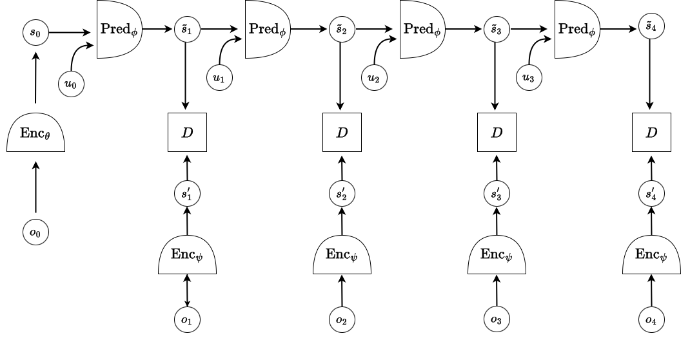

# JEPA Agent World Model

**Team: Final Epoch**

This project implements a Joint Embedding Predictive Architecture (JEPA) for learning world models in a two-room navigation environment. The model learns to predict future state representations given current observations and actions, without requiring pixel-level reconstruction.

## Problem Setup

We train on trajectories from an environment where an agent navigates between two rooms connected by a door. The challenge lies in the dynamic nature of the environment - wall and door positions vary across episodes, requiring the model to understand spatial layouts rather than memorize fixed configurations.



## Architecture

Our implementation consists of three main components:

**VICRegEncoderWithoutFlattening**: Processes 64×64 two-channel images (agent position and wall layout) through convolutional layers, producing 32×4×4 spatial feature maps. We preserve spatial structure throughout the encoding process rather than flattening early.

**CNNPredictor**: Takes encoded state representations and actions to predict future states. Actions are mapped to spatial feature maps and combined with current state features through concatenation and convolution. This spatial action integration proved more effective than simple vector concatenation.

**JEPA Model**: Combines the encoder and predictor in a recurrent framework. During training, the model predicts sequences of future representations autoregressively. For evaluation, it generates flattened representations suitable for downstream probing tasks.

## Training Objective

We employ a multi-component loss function inspired by VICReg to prevent representation collapse:

```
L_total = λ_pred × L_mse + λ_var × L_variance + λ_cov × L_covariance
```

- **Prediction Loss**: MSE between predicted and target representations
- **Variance Loss**: Maintains representation diversity across batch dimensions  
- **Covariance Loss**: Decorrelates representation dimensions

Final hyperparameters: λ_pred = 25.0, λ_var = 25.0, λ_cov = 1.0

## Training Configuration

- Dataset: 2.5M trajectory frames with varying room layouts
- Optimizer: SGD with momentum (0.9) and weight decay (1e-3)
- Learning rate: 1e-3
- Batch size: 128
- Training epochs: 100
- Model parameters: 103,680

## Environment Details


The agent operates in a two-room environment with variable wall configurations. Each trajectory presents different spatial layouts, preventing the model from relying on memorized room structures. The agent must learn general navigation principles and collision dynamics.

## Evaluation Results

Model performance on coordinate prediction tasks:

| Validation Set | MSE Loss | Description |
|----------------|----------|-------------|
| Normal | 2.39 | Standard navigation trajectories |
| Wall | 8.79 | Trajectories involving wall collisions |
| Expert | 10.73 | Long-horizon prediction scenarios |

Performance degrades on wall collision and long-horizon cases, indicating limitations in modeling complex dynamics and temporal dependencies.

## Key Design Decisions

**Spatial Preservation**: Maintaining spatial structure in representations rather than early flattening improved performance on this spatially-grounded task.

**Action Integration**: Mapping actions to spatial feature maps and performing spatial combination yielded better results than concatenating action vectors to flattened features.

**Regularization Balance**: The variance and covariance terms proved essential for preventing representation collapse, with careful tuning required to balance prediction accuracy and representation quality.

**Model Scale**: Despite the relatively small parameter count (~104K), the model achieves reasonable performance, suggesting the architecture efficiently captures relevant dynamics.

## Usage

Training:
```bash
python train.py
```

Evaluation:
```bash
python main.py
```

The evaluation script trains linear probes on learned representations to predict agent coordinates, providing a measure of representation quality.

## Limitations and Future Work

The model shows clear limitations on wall collision dynamics and long-horizon prediction. Wall interactions represent a significant challenge where simple prediction fails. Long-horizon accuracy degrades as expected, suggesting the need for more sophisticated temporal modeling or hierarchical approaches.

Future directions include investigating attention mechanisms for long-range dependencies, exploring hierarchical representations for multi-scale prediction, and extending to more complex environments with multiple objects.

## Repository Structure

```
├── main.py              # Evaluation and probing
├── train.py             # Model training loop
├── models.py            # Architecture definitions
├── dataset.py           # Data loading utilities
├── evaluator.py         # Probing evaluation logic
├── model_weights.pth    # Trained model checkpoint
├── requirements.txt     # Package dependencies
└── metrics.txt          # Performance summary
```

---

**Course**: CSCI-GA 2572 Deep Learning, NYU
